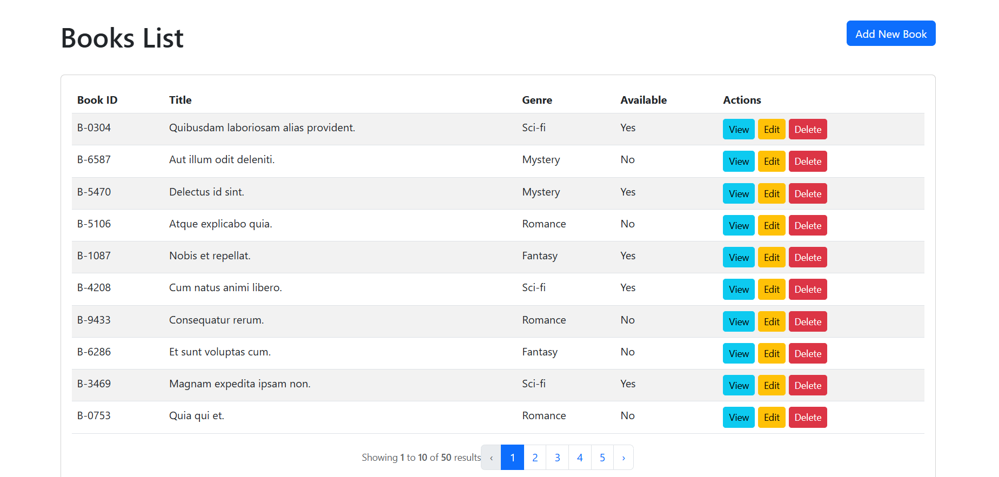
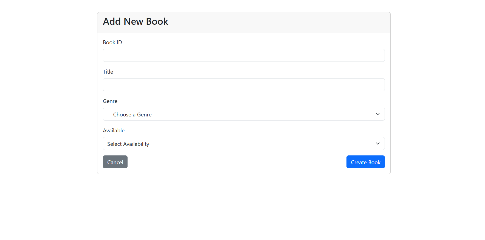
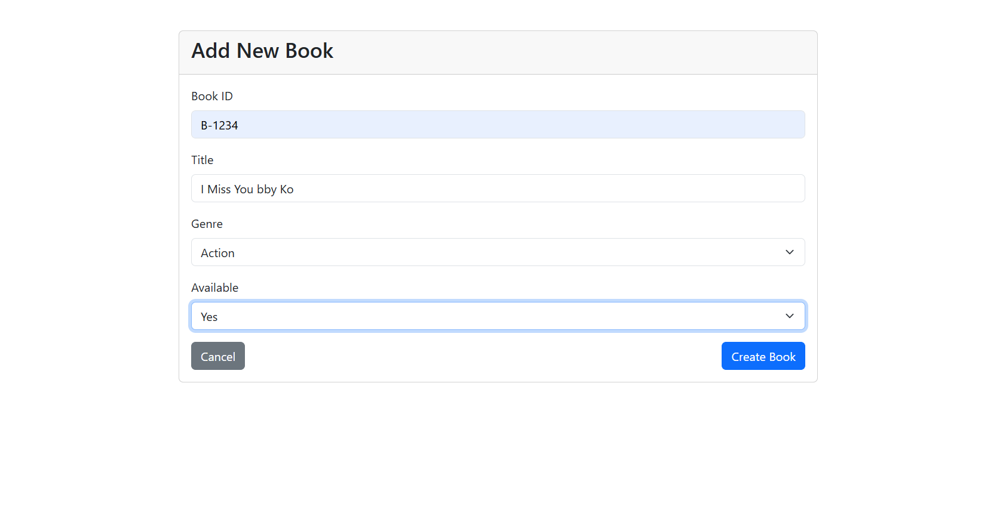
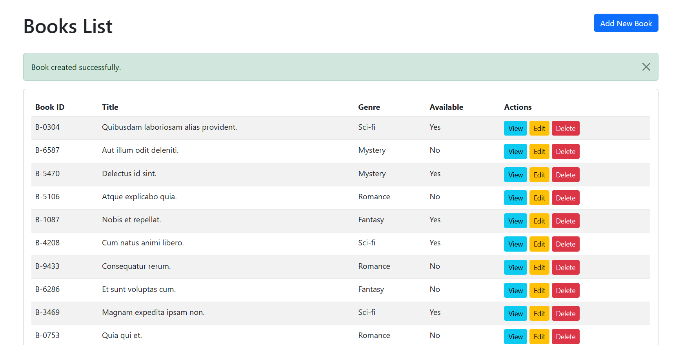
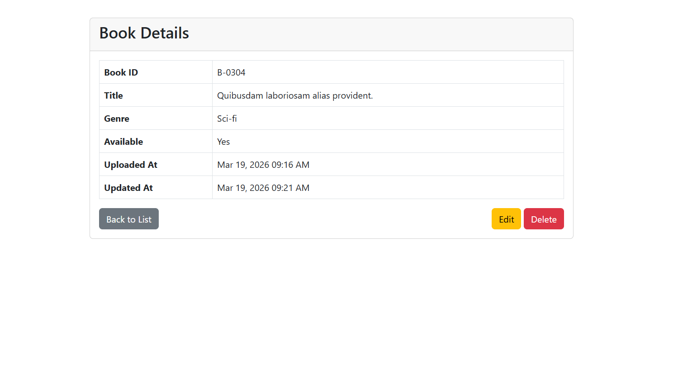
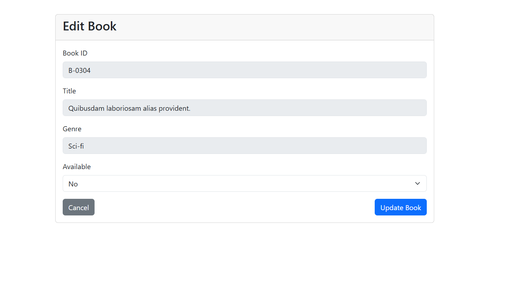
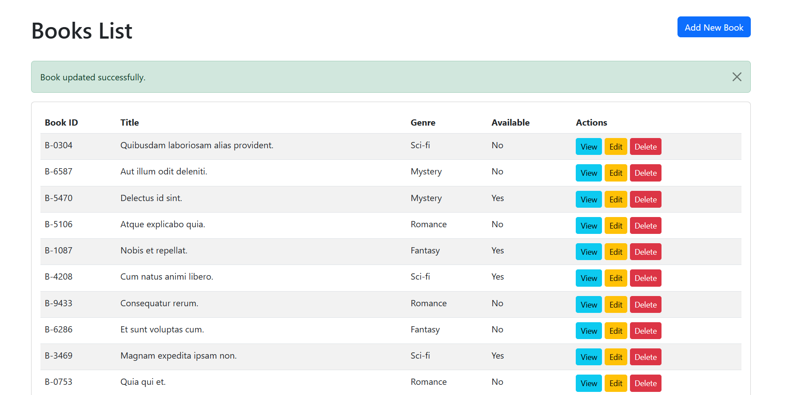
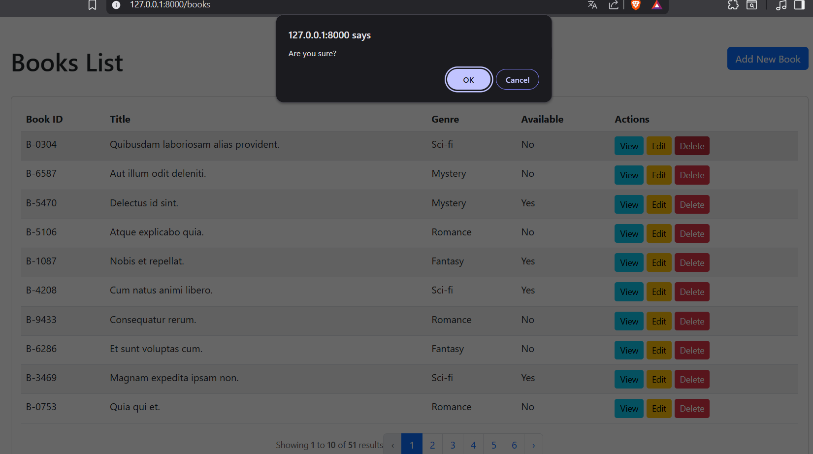
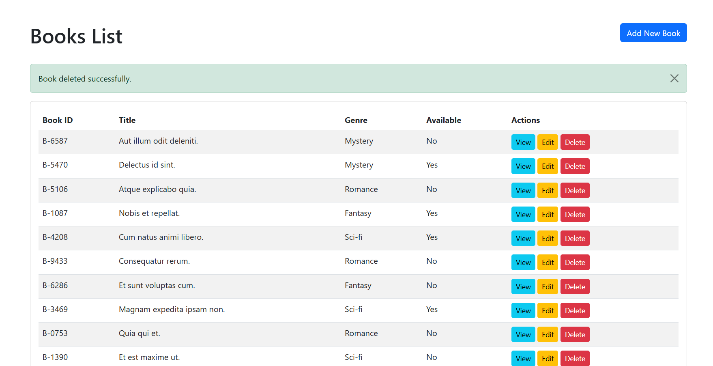

# 📁 Library Management System (LMS)
A simple management system that allows Librian and like to add books to the list, see the availability of books and many more.

# 📖 Database fields used

- id
- book_Id
- title
- genre
- is_available
- Timestamps (created_at and updated_at)

# 🖼️ A screenshot showing the working CRUD operations
**Main Page**

**CREATE**

**READ**

**UPDATE**

**DELELTE**

